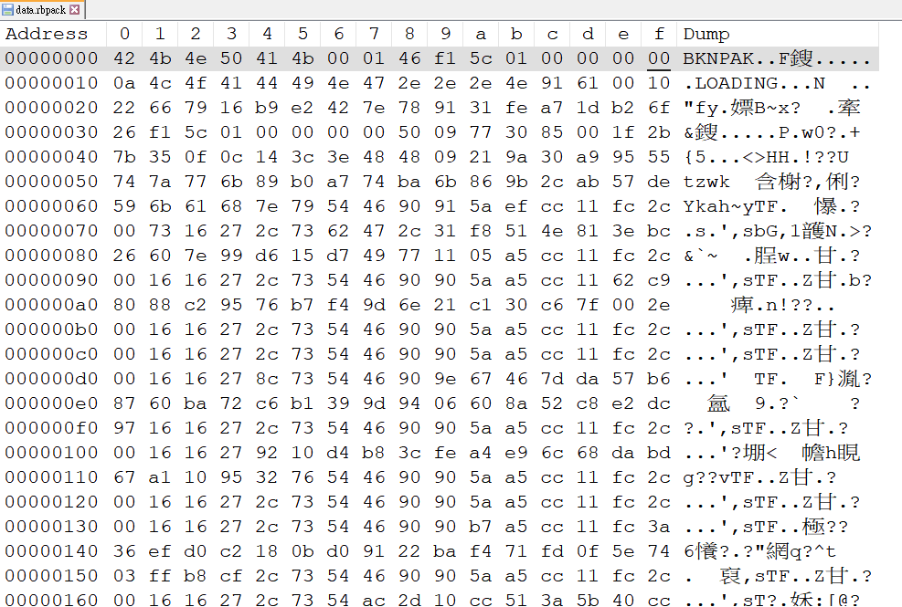
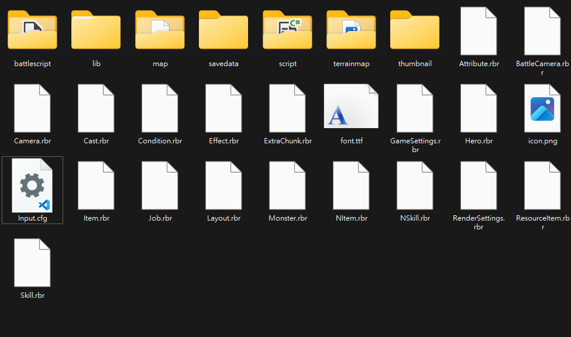

English | [繁體中文](README_TCH.md)
# I found a awesome bakin extractor
After several months. I found a awesome extractor by a clever engineer: [Bakin Extractor](https://github.com/HNIdesu/BakinExtractor/tree/main)
# BakinUnpack
A repo for researching how to unpack game made of rpg develop bakin.

# Why am I doing this?
RPG Developer Bakin is a new engine making game.

And apearly there are nothing on the internet show how to unpack game file of bakin games.

I wonder how bakin packed game file and make its own struct. So I started to research their encoding and game files.

# How to start?
I know little about bakin. So I google it and asked some of my friend also know little about bakin.

All I got is that bakin is a new version of SGB, also known as Smile Game Builder.

There are less bakin discussion on internet. But there are more discussion about SGB.

> This section is based on [a tweet from x](https://twitter.com/KerokeroCoder/status/1120027976320421888).
> Also some of my inference.
SGB using a special file format called ```.sgbpack```. And it has a certain pattern on its encoding:
* In the early edition of SGB using zip to pack its game file.
  * But it change the file header from zip: ```50 4B 03 04 14 00 00 00``` to its own header: ```59 55 4B 41 52 50 4B 47 (YUKARPKG)```
* But official soon change the method how they encoding:
  * ```53 47 42 44 41 54 00 01 (SGBDAT)```
  * Nobody know how to deal with it.
  * And it has lots chance that Bakin still using this encoding.

In the bakin I assume it use ```.rbpack``` to packed game file.
* I found that header is ```42 4b 4e 50 41 4b (BKNPAK)```.


# temp file
I found out that bakin will create temp file during games at the windows temp path:
* ```C:\Users\{username}\AppData\Local\Temp\bakin_engine_tmp```

There are many ```.rbr``` file. Still have no clue how to deal with it.

